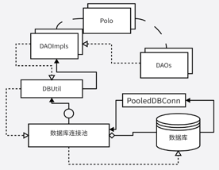
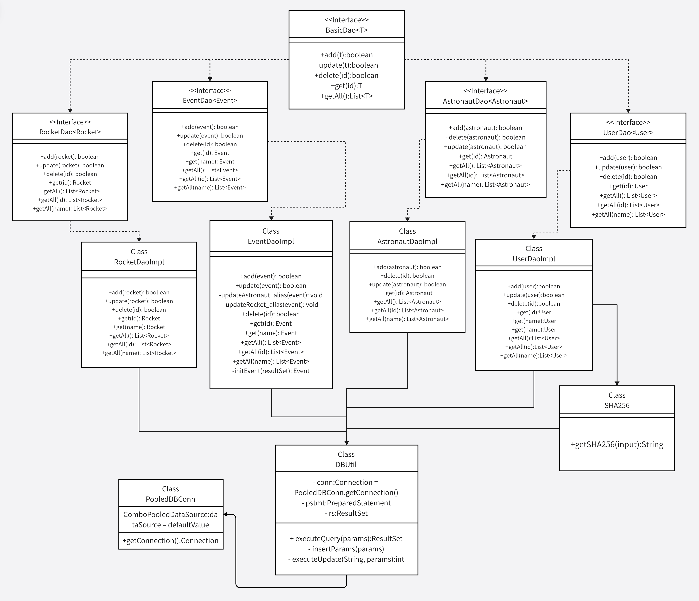

Java课程设计
===============

密码加密使用SHA-256，将输入加密后与数据库中存储的密文比较，提高安全性！

## 前端技术

- 基础框架：JavaFX 21.0.1
> 解决原JavaFX框架与macOS Sonoma的兼容性问题

- 快速构建工具：SceneBuilder

## 后端技术

- 连接池拓展：C3p0 0.9.5.5
- 明文加密：SHA-256

## 开发环境

- 语言：Java 17

- IDE(Java)： IDEA

- 依赖管理：Maven 3.9+

- 数据库：MySQL 8.0+

### 后端结构图：



### 后端类关系：




加密实现：

```java
import org.jetbrains.annotations.NotNull;

public class SHA256 {
    @NotNull
    public static String getSHA256(@NotNull String input) {
        try {
            MessageDigest md = MessageDigest.getInstance("SHA-256");
            byte[] messageDigest = md.digest(input.getBytes());
            BigInteger no = new BigInteger(1, messageDigest);
            StringBuilder hashText = new StringBuilder(no.toString(16));
            while (hashText.length() < 64) {
                hashText.insert(0, "0");
            }
            return hashText.toString();
        } catch (NoSuchAlgorithmException e) {
            throw new RuntimeException(e);
        }
    }
}
```

数据库连接池实现类：
```java
public class PooledDBConn {
    private static final ComboPooledDataSource dataSource = new ComboPooledDataSource();
    static {
        try (Scanner sc = new Scanner(Objects.requireNonNull(PooledDBConn.class.getClassLoader().getResourceAsStream("config.yml")))) {
            // 注册驱动
            dataSource.setDriverClass("com.mysql.cj.jdbc.Driver");
            // 设置连接参数
            dataSource.setJdbcUrl(sc.nextLine().split(": ")[1]);
            dataSource.setUser(sc.nextLine().split(": ")[1]);
            dataSource.setPassword(sc.nextLine().split(": ")[1]);
            dataSource.setMaxPoolSize(40);
            dataSource.setMinPoolSize(2);
            dataSource.setInitialPoolSize(10);
            dataSource.setMaxStatements(100);
        } catch (PropertyVetoException e) {
            e.printStackTrace(System.err);
        }
    }
    @Nullable
    public static Connection getConnection() throws SQLException {
        // 获得数据库连接
        try {
            return dataSource.getConnection();
        } catch (SQLException e) {
            e.printStackTrace();
        }
        return null;
    }
}
```

多表联查SQL（左连接）：
```mysql
SELECT
	r.rocketID,
	e.`name`,
	r.rocketName,
	r.launchDate,
	e.anames,
	e.mean 
FROM
	`rocket` r
	LEFT JOIN `event` e ON r.rocketID = e.rocketID
```